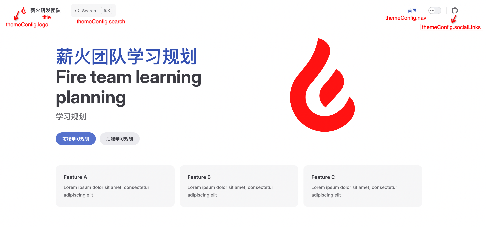
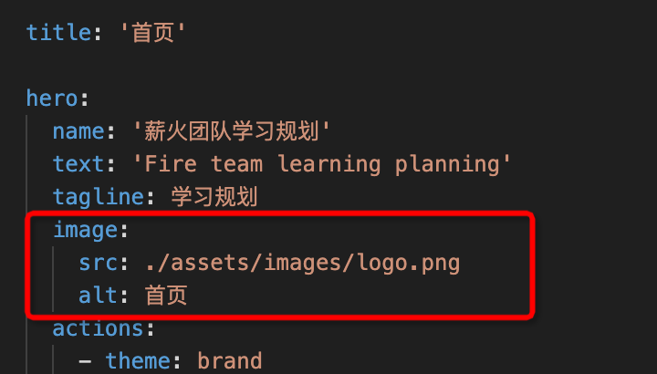
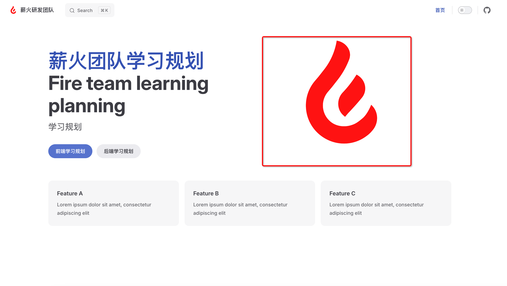

# 使用方法

## 运行项目

首先先安装 vitepress

```sh
yarn add -D vitepress
```

然后运行项目

```sh
yarn run docs:dev
```

## 添加页面

在 docs 文件下新建一个`.md 的文件`，此 md 文件名就是路径名

## 编辑页面

使用 markdown 语言，也可结合 vue 和 html 来使用

引用图片可使用网络图片，若想使用本地图片，则需将图片放入到 `assets -> images` 文件夹中

## 项目配置

[官方文档](https://vitepress.dev/zh/reference/default-theme-config)

### 头部

在`docs -> .vitepress -> config.mts`中的`themeConfig`中修改，各自对应字段如下：

- [左侧 logo](https://vitepress.dev/zh/reference/default-theme-config#logo) 对应 `logo`
- `左侧搜索`对应 `search`，其中 provider 对应搜索方式
- [右侧菜单栏](https://vitepress.dev/zh/reference/default-theme-config#nav)对应`nav`，可用 `items`设置下拉框
- [右侧社交账户链接](https://vitepress.dev/zh/reference/default-theme-config#sociallinks)对应`socialLinks`

```ts
export default defineConfig({
  themeConfig: {
    logo: 'xxx',
    search: {
      provider: 'xxx',
    },
    nav: [
      { text: 'xxx', link: 'xxx' },
      {
        text: 'xxx',
        items: [{ text: 'xxx', link: 'xxx' }],
      },
    ],

    socialLinks: [{ icon: 'xxx', link: 'xxx' }],
  },
})
```



### 首页配置

> 首页的文件是 index.md，以下内容都在 index.md 文件中修改

#### 首页右侧 logo

在 index.md 文件中的 hero 下修改



效果如下：


#### 首页左侧文本部分

在 index.md 文件中的 hero 下修改，各字段对应图上的位置


### 详情页

#### 左侧侧边栏目录

在`docs -> .vitepress -> config.mts`中的`themeConfig`中修改，对应 [sidebar](https://vitepress.dev/zh/reference/default-theme-config#sidebar) 字段


```ts
export default defineConfig({
  themeConfig: {
    sidebar: [
      {
        text: 'xxx',
        items: [{ text: 'xxx', link: 'xxx' }],
      },
    ],
  },
})
```

#### 右侧页面导航名

```ts
export default defineConfig({
  themeConfig: {
    outlineTitle: 'xxx',
  },
})
```

### SEO 设置

- `标签页图标`：在 head 里面设置
- `seo-title`：对应下面代码中的`title`
- `seo-description`: 对应下面代码中的 `description`
- `seo-keywords`: 在 head 里面设置，如下
- `seo 的统一后缀`：对应下面代码中的 `titleTemplate`，如果不设置，则`默认为title` 对应的值；若不想设置统一后缀，则 `titleTemplate 可设置为 false`

```ts
export default defineConfig({
  title: 'xxx',
  description: 'xxx',
  head: [
    ['link', { rel: 'icon', href: 'xxx' }],
    ['meta', { name: 'keywords', content: 'xxx' }],
  ],
  titleTemplate: 'xxxx',
})
```

**单个页面设置 seo**

在要设置的文件里面加上如下语句

```md
---
title: 'xxx'
description: 'xxx'
keywords: 'xxx'
---
```
